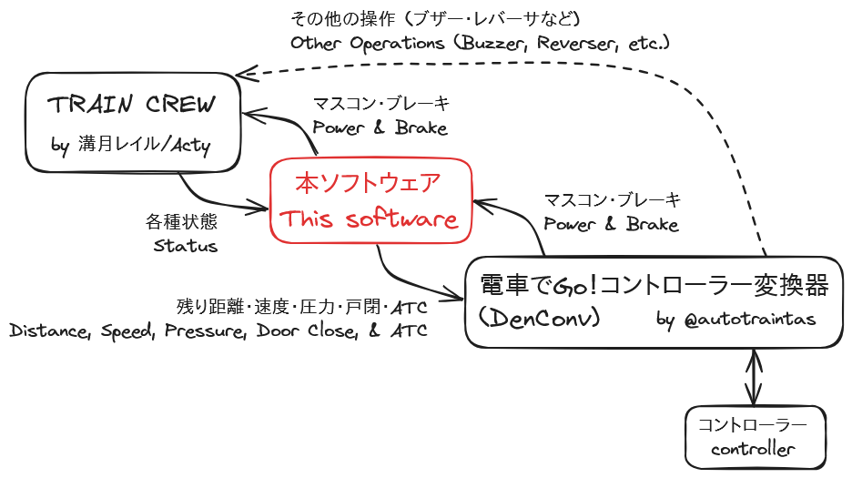
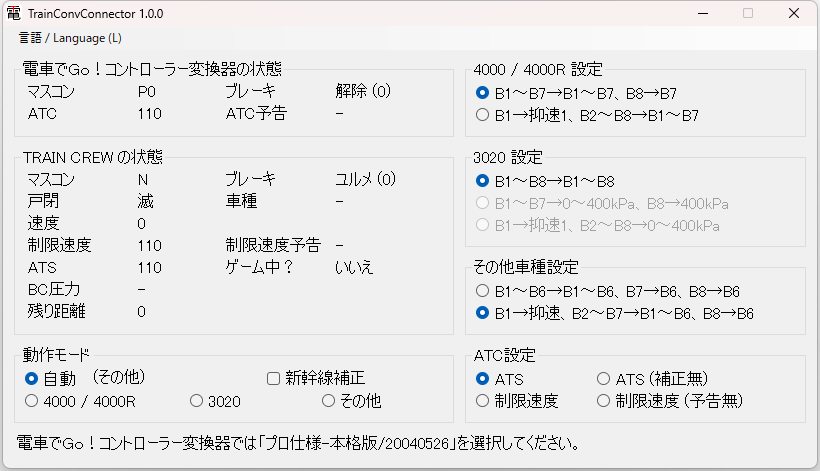
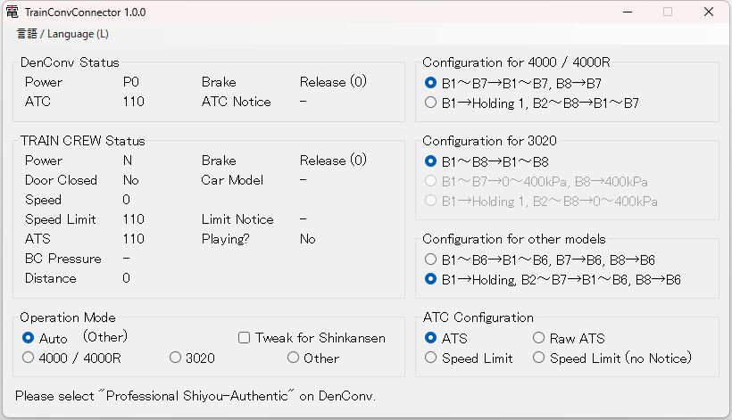

TrainConvConnector
==================

## 概要 / Overview

[TRAIN CREW](https://acty-soft.com/traincrew/) と [電車でGo！コントローラー変換器](https://autotraintas.hariko.com/) を接続し、ツーハンドルなどの TRAIN CREW が公式で対応していないコントローラーで電車を運転できるようにします。  
このソフトウェアは**非公式**であり、TRAIN CREW や電車でGo！コントローラー変換器の作者様とは関係ありません。

※電車でGo！コントローラー変換器 ver3.72 は開発者の環境で正常に動作せず、連携の確認がとれていません。[ver3.70](https://web.archive.org/web/20240529001140/https://autotraintas.hariko.com/) を使用することを推奨します。

This software relays between [TRAIN CREW](https://acty-soft.com/traincrew/) and [DenConv](https://autotraintas.hariko.com/) to enable you control trains via controllers that are not officially supported in TRAIN CREW, such as two-handle controllers.  
This software is **unofficial**, and has no relationships with creators of TRAIN CREW and DenConv.

Note: DenConv ver3.72 is not working well in developer's environment, so this software is not tested with the version. I recommend using [ver3.70](https://web.archive.org/web/20240529001140/https://autotraintas.hariko.com/).

## 利点 / Merits

電車でGo！コントローラー変換器のキーボード出力機能でも TRAIN CREW を操作することはできますが、本ソフトウェアを用いることで以下のような利点が得られます。

* 操作のズレの心配をせずに操作できる
* TRAIN CREW の各車種に合わせた細かい変換ができる
* 操作を行うだけでなく、電車の状態を対応コントローラーに表示できる

While TRAIN CREW can be controlled via the keyboard output function of DenConv, using this software has these merits:

* We can control trains without worrying about slipping of control.
* Detailed conversions for each car models in TRAIN CREW are available.
* Status of trains can be displayed on supported controllers while controlling trains.

## スクリーンショット / Screenshots

### 日本語

### English

## ライセンス / License

TrainConvConnector は、MITライセンスです。

TrainCrewInput.dll (TRAIN CREW 入出力ライブラリ) は溝月レイル/Acty様の制作物であり、MITライセンスの対象外です。
TrainCrewInput.dll の解析や改変は禁止されています。

TrainConvConnector is licensed under the MIT License.

TrainCrewInput.dll (the library for communicating with TRAIN CREW) is created by 溝月レイル/Acty, and isn't licensed under the MIT License.
Analyzation and modification of TrainCrewInput.dll are prohibited.

## ビルド方法 / How to build

Windows 環境では、以下の方法でビルドを行います。

1. `make` コマンドを使えるようにする  
   例えば [Make for Windows](https://gnuwin32.sourceforge.net/packages/make.htm) をインストールする
2. C# コンパイラ `csc.exe` があるディレクトリにパスを通す  
   例えば `C:\Windows\Microsoft.NET\Framework\v4.0.30319`
3. `make` コマンドを実行する

This is how to build this software on Windows.

1. Make the `make` command available.  
   For example, install [Make for Windows](https://gnuwin32.sourceforge.net/packages/make.htm).
2. Add the directory where the C# compiler `csc.exe` is to the PATH.  
   For example, it may be at `C:\Windows\Microsoft.NET\Framework\v4.0.30319`.
3. Run the `make` command.
